# Instagram Saver System - Complete Technical Documentation

## 📋 Table of Contents
1. [Executive Summary](#executive-summary)
2. [System Architecture](#system-architecture)
3. [Component Details](#component-details)
4. [Workflows & Data Flow](#workflows--data-flow)
5. [Technical Stack](#technical-stack)
6. [Network & Infrastructure](#network--infrastructure)
7. [Setup Process](#setup-process)
8. [Security & Privacy](#security--privacy)
9. [Error Handling & Resilience](#error-handling--resilience)
10. [Testing Strategy](#testing-strategy)
11. [Troubleshooting Guide](#troubleshooting-guide)

---

## 1. Executive Summary

### 1.1 Problem Statement
You currently save Instagram reels/posts manually by navigating to the save menu and selecting a collection. This process is:
- Time-consuming (4-6 taps per save)
- Breaks viewing flow
- Requires looking at small UI elements on mobile/desktop

### 1.2 Solution Overview
A cross-device system that turns your old iPad into a dedicated "save panel" with large, touch-friendly tag buttons that sync in real-time with whatever content you're viewing on your MacBook.

### 1.3 Key Features
- **Real-time sync**: iPad shows current reel/post automatically
- **One-tap save**: Large buttons for each tag category
- **Automated saving**: Extension automatically saves to Instagram collections
- **Multi-platform**: Initially Instagram, expandable to YouTube, Twitter, TikTok
- **Visual feedback**: Animations and confirmations for successful saves

---

## 2. System Architecture

### 2.1 High-Level Architecture

```
┌─────────────────────────────────────────────────────────────────┐
│                        YOUR MACBOOK                              │
│                                                                  │
│  ┌────────────────────┐        ┌─────────────────────┐         │
│  │  Chrome Browser    │◄──────►│  WebSocket Server   │         │
│  │  ═══════════════   │        │  (Node.js)          │         │
│  │  Instagram.com     │        │  Port: 8080         │         │
│  │  ┌──────────────┐  │        │                     │         │
│  │  │  Extension   │  │        │  - Manages clients  │         │
│  │  │  ┌────────┐  │  │        │  - Routes messages  │         │
│  │  │  │Content │  │  │        │  - HTTP server      │         │
│  │  │  │Script  │  │  │        └─────────────────────┘         │
│  │  │  └────────┘  │  │                  │                     │
│  │  │  ┌────────┐  │  │                  │                     │
│  │  │  │Backgrd │  │  │                  │                     │
│  │  │  │Worker  │  │  │                  │                     │
│  │  │  └────────┘  │  │                  │                     │
│  │  └──────────────┘  │                  │                     │
│  └────────────────────┘                  │                     │
│                                           │                     │
└───────────────────────────────────────────┼─────────────────────┘
                                            │
                                            │ WebSocket
                                            │ (WiFi Network)
                                            │
┌───────────────────────────────────────────┼─────────────────────┐
│                        YOUR IPAD          │                     │
│                                           ▼                     │
│  ┌────────────────────────────────────────────────────┐        │
│  │           Safari Browser (Fullscreen)              │        │
│  │  ═════════════════════════════════════════════════ │        │
│  │  ┌──────────────────────────────────────────────┐  │        │
│  │  │        iPad Touch Interface (HTML)           │  │        │
│  │  │                                              │  │        │
│  │  │  [Current: instagram.com/reel/abc123]       │  │        │
│  │  │                                              │  │        │
│  │  │  ┌──────────┐  ┌──────────┐  ┌──────────┐  │  │        │
│  │  │  │Technology│  │Motivation│  │Information│  │  │        │
│  │  │  └──────────┘  └──────────┘  └──────────┘  │  │        │
│  │  │  ┌──────────┐  ┌──────────┐  ┌──────────┐  │  │        │
│  │  │  │Companies │  │ Design   │  │  Coding  │  │  │        │
│  │  │  └──────────┘  └──────────┘  └──────────┘  │  │        │
│  │  │                                              │  │        │
│  │  │  WebSocket Client (JavaScript)               │  │        │
│  │  └──────────────────────────────────────────────┘  │        │
│  └────────────────────────────────────────────────────┘        │
└─────────────────────────────────────────────────────────────────┘
```

### 2.2 Architecture Principles

1. **Decoupled Components**: Each component operates independently
2. **Real-time Communication**: WebSocket for instant synchronization
3. **Progressive Enhancement**: Works with basic functionality, enhanced with automation
4. **Fault Tolerance**: Automatic reconnection and graceful degradation
5. **Platform Agnostic**: Designed for easy expansion to other platforms

### 2.3 Component Responsibilities

| Component | Responsibility |
|-----------|---------------|
| **WebSocket Server** | Central hub for message routing between devices |
| **Browser Extension** | Detects content, automates Instagram saves |
| **Content Script** | Monitors page, extracts content info, DOM automation |
| **Background Worker** | Maintains WebSocket connection, message relay |
| **iPad Interface** | Displays content info, provides touch UI for tags |

---

## 3. Component Details

### 3.1 WebSocket Server (Node.js)

#### Purpose
Acts as the central communication hub between your MacBook browser and iPad.

#### Technical Specifications
- **Runtime**: Node.js v18+
- **Port**: 8080 (configurable)
- **Protocol**: WebSocket (ws://)
- **HTTP Server**: Serves iPad interface HTML

#### Key Functions
```javascript
// Server manages two types of clients:
{
  extension: WebSocket,  // Browser extension connection
  ipad: WebSocket       // iPad interface connection
}

// Message routing:
extension → server → ipad    // Content detection
ipad → server → extension    // Save command
```

#### Message Types
1. **register**: Client identifies itself (extension or ipad)
2. **current_content**: Extension sends current URL/platform
3. **save_to_tag**: iPad requests save to specific collection
4. **save_confirmation**: Extension confirms successful save

#### Performance Characteristics
- **Latency**: <50ms for message relay on local network
- **Throughput**: Handles 100+ messages/second
- **Connection**: Persistent, with ping/pong keep-alive every 30s

### 3.2 Chrome Extension

#### Manifest V3 Structure
```
extension/
├── manifest.json       # Extension configuration
├── background.js       # Service worker (always running)
├── content.js         # Injected into Instagram pages
├── popup.html         # Extension popup UI
├── popup.js           # Popup logic
└── icons/             # Extension icons
    ├── icon16.png
    ├── icon48.png
    └── icon128.png
```

#### Background Service Worker

**Lifecycle**: Persistent (kept alive with alarms)

**Responsibilities**:
- Maintain WebSocket connection to server
- Relay messages between content scripts and server
- Handle reconnection logic
- Monitor tab updates

**Connection Management**:
```javascript
// Reconnection strategy:
1. Initial connection on load
2. On disconnect: wait 3 seconds, retry
3. Keep-alive ping every 30 seconds
4. Chrome alarm every 0.5 minutes to prevent worker sleep
```

#### Content Script

**Injection**: Runs on all Instagram, YouTube, Twitter, TikTok pages

**Detection Logic**:
```javascript
// Platform detection:
Instagram: /\/(?:reel|reels|p)\/([^/?]+)/
YouTube: /[?&]v=([^&]+)|\/shorts\/([^/?]+)/
Twitter: /\/status\/(\d+)/
TikTok: /\/video\/(\d+)/
```

**URL Monitoring**:
- Interval check every 1 second
- MutationObserver for immediate SPA navigation detection
- Deduplication to prevent duplicate notifications

#### Instagram Automation Algorithm

**Save Flow**:
```
1. Find save button (SVG bookmark icon)
   ├─ Check if already saved (filled icon)
   └─ Click if not saved

2. Wait for collection menu (800ms)

3. Find collection by name
   ├─ If found: Click collection
   └─ If not found: Create new collection
      ├─ Click "New collection"
      ├─ Enter name
      └─ Click "Create"

4. Confirm success
```

**DOM Selectors** (Instagram changes these frequently):
```javascript
// Primary selectors:
saveButton: 'svg[aria-label="Save"]'
collections: 'button, [role="button"]'
input: 'input[placeholder*="ollection"]'

// Fallback selectors:
bookmark: '[role="button"] svg path[d*="M20 21v-2"]'
```

**Reliability Measures**:
- Multiple selector strategies
- Visibility checks before clicking
- Configurable delays for UI rendering
- Error logging for debugging

### 3.3 iPad Touch Interface

#### Technical Specifications
- **Type**: Single-page web application (SPA)
- **Framework**: Vanilla JavaScript (no dependencies)
- **Protocol**: WebSocket client
- **Viewport**: Fullscreen, non-scrollable

#### UI Layout
```
┌────────────────────────────────────────┐
│ Header (Status Bar + Current Content) │
│ ────────────────────────────────────── │
│                                        │
│  ┌─────────┐  ┌─────────┐  ┌────────┐ │
│  │  TAG 1  │  │  TAG 2  │  │ TAG 3  │ │
│  │  (150px)│  │  (150px)│  │ (150px)│ │
│  └─────────┘  └─────────┘  └────────┘ │
│                                        │
│  ┌─────────┐  ┌─────────┐  ┌────────┐ │
│  │  TAG 4  │  │  TAG 5  │  │ TAG 6  │ │
│  └─────────┘  └─────────┘  └────────┘ │
│                                        │
│  ┌─────────┐  ┌─────────┐             │
│  │  TAG 7  │  │  TAG 8  │             │
│  └─────────┘  └─────────┘             │
│                                        │
│                     ┌──────────────┐   │
│                     │ Settings (⚙️) │   │
│                     └──────────────┘   │
└────────────────────────────────────────┘
```

#### Button Design Specifications
- **Size**: 150px × 150px (minimum touch target: 44px)
- **Spacing**: 20px gap between buttons
- **Font**: 18px bold, high contrast
- **States**:
  - Default: Translucent background
  - Active (tap): Scale animation (0.95)
  - Success: Green flash animation
  - Error: Red shake animation

#### Interaction Patterns
```javascript
// Tap flow:
User taps button
  → Scale down animation (100ms)
  → Send save command via WebSocket
  → Wait for confirmation
  → Success: Green flash (300ms)
  → Error: Red shake + error message
```

#### Configuration Management
```javascript
// Stored in localStorage:
{
  serverUrl: "ws://192.168.1.5:8080",
  tags: [
    { id: 1, name: "Technology", color: "#4CAF50" },
    { id: 2, name: "Motivation", color: "#2196F3" },
    { id: 3, name: "Information", color: "#FF9800" },
    // ... user-defined tags
  ],
  theme: "dark" | "light"
}
```

---

## 4. Workflows & Data Flow

### 4.1 Complete System Workflow

```mermaid
sequenceDiagram
    participant User
    participant MacBook_Browser
    participant Extension
    participant Server
    participant iPad

    Note over Server: Server running on MacBook
    
    Extension->>Server: Connect (register as extension)
    iPad->>Server: Connect (register as ipad)
    Server-->>Extension: Connection confirmed
    Server-->>iPad: Connection confirmed
    
    User->>MacBook_Browser: Navigate to Instagram reel
    MacBook_Browser->>Extension: Page loaded
    Extension->>Extension: Content script detects URL
    Extension->>Server: current_content {url, platform}
    Server->>iPad: current_content {url, platform}
    iPad->>iPad: Update display with current content
    
    User->>iPad: Tap "Technology" button
    iPad->>Server: save_to_tag {tag: "Technology", url}
    Server->>Extension: save_to_tag {tag: "Technology"}
    Extension->>Extension: Content script automates Instagram save
    Extension->>Extension: Click save button → Select collection
    Extension->>Server: save_confirmation {success: true}
    Server->>iPad: save_confirmation {success: true}
    iPad->>User: Show success animation
```



### 4.2 Detailed Workflows

#### Workflow 1: Initial Connection Setup

```
STEP 1: Start Server (MacBook)
├─ Open Terminal
├─ Navigate to project directory
├─ Run: npm start
└─ Server listens on http://localhost:8080

STEP 2: Load Extension (MacBook Chrome)
├─ Open chrome://extensions
├─ Enable Developer Mode
├─ Load unpacked extension
└─ Extension background worker starts

STEP 3: Connect Extension
├─ Extension creates WebSocket to ws://localhost:8080
├─ Sends: {type: "register", client: "extension"}
└─ Server stores extension connection

STEP 4: Open iPad Interface (iPad Safari)
├─ Get MacBook's IP address (e.g., 192.168.1.5)
├─ Navigate to: http://192.168.1.5:8080
├─ Page loads from server
└─ JavaScript creates WebSocket connection

STEP 5: Connect iPad
├─ iPad sends: {type: "register", client: "ipad"}
├─ Server stores iPad connection
└─ System ready!
```

#### Workflow 2: Content Detection

```
USER ACTION: Scroll to new reel on Instagram

BROWSER:
├─ URL changes: instagram.com/reel/abc123
└─ Content script MutationObserver triggers

CONTENT SCRIPT:
├─ Detect URL pattern: /reel/([^/?]+)/
├─ Extract: platform="instagram", url="full_url"
├─ Check if different from last detected URL
└─ Send to background worker

BACKGROUND WORKER:
├─ Receive content_detected message
├─ Format: {type: "current_content", url, platform}
└─ Send via WebSocket to server

SERVER:
├─ Receive message from extension client
├─ Identify target: ipad client
└─ Forward message to iPad

IPAD:
├─ Receive current_content message
├─ Update UI: display URL and platform
└─ Enable tag buttons
```

#### Workflow 3: Save to Collection

```
USER ACTION: Tap "Technology" button on iPad

IPAD:
├─ Button tap event triggered
├─ Disable button (prevent double-tap)
├─ Play tap animation
└─ Send: {type: "save_to_tag", tag: "Technology", url}

SERVER:
├─ Receive from iPad client
├─ Route to extension client
└─ Forward: {type: "save_to_tag", tag: "Technology"}

BACKGROUND WORKER:
├─ Receive save_to_tag message
├─ Get active tab ID
└─ Send message to content script on that tab

CONTENT SCRIPT:
├─ Receive save_to_collection message
├─ Start Instagram automation:
│  ├─ Find save button (SVG bookmark)
│  ├─ Click save button (if not already saved)
│  ├─ Wait 800ms for menu
│  ├─ Find "Technology" collection
│  ├─ Click collection
│  └─ Wait for confirmation
└─ Send: {type: "save_complete", success: true}

BACKGROUND WORKER:
├─ Receive save_complete
└─ Forward confirmation to server

SERVER:
├─ Receive confirmation
└─ Forward to iPad

IPAD:
├─ Receive save_confirmation
├─ Play success animation (green flash)
├─ Re-enable button
└─ Show temporary success message
```

### 4.3 Error & Edge Cases

#### Case 1: Network Disconnection

```
DETECTION:
├─ WebSocket onclose event
└─ Or: Failed to send message

RECOVERY (Extension):
├─ Log disconnection
├─ Set reconnect timer (3 seconds)
├─ Clear WebSocket reference
└─ Attempt reconnection
   ├─ Success: Resume normal operation
   └─ Failure: Retry after 3 seconds

RECOVERY (iPad):
├─ Update UI: Show disconnected status
├─ Disable all tag buttons
├─ Attempt reconnection (5 second intervals)
└─ On reconnect: Re-register and enable buttons
```

#### Case 2: Collection Not Found

```
CONTENT SCRIPT:
├─ Automation attempts to find "Technology" collection
├─ Collection not found in menu
└─ Trigger createNewCollection()
   ├─ Find "New collection" button
   ├─ Click button
   ├─ Wait for input field (500ms)
   ├─ Enter "Technology"
   ├─ Click "Create"
   ├─ Wait for menu to update (500ms)
   └─ Return success

RETRY:
├─ If creation fails
└─ Send error to iPad with manual save instruction
```

#### Case 3: Instagram DOM Changes

```
DETECTION:
├─ Selectors return null/undefined
└─ Operation times out

FALLBACK STRATEGY:
├─ Try alternative selectors
├─ Log error with current DOM state
├─ Send user notification:
   "Instagram updated. Please save manually.
    URL copied to clipboard."
└─ Copy URL to clipboard for manual save
```

---

## 5. Technical Stack

### 5.1 Development Stack

| Component | Technology | Version | Justification |
|-----------|-----------|---------|---------------|
| **Server Runtime** | Node.js | 18.x+ | Stable, excellent WebSocket support |
| **WebSocket Library** | ws | 8.16.0 | Lightweight, well-maintained |
| **Extension Platform** | Chrome Manifest V3 | - | Modern, required for new extensions |
| **Frontend** | Vanilla JavaScript | ES2020+ | No build step, fast loading |
| **HTTP Server** | Node http module | Built-in | Simple, sufficient for SPA |
| **Package Manager** | npm | 9.x+ | Standard for Node.js |

### 5.2 Runtime Requirements

#### MacBook Requirements
- **OS**: macOS 11+
- **Node.js**: v18.0.0 or higher
- **Chrome**: v88+ (Manifest V3 support)
- **RAM**: 100MB for server + extension
- **Network**: WiFi (for iPad communication)

#### iPad Requirements
- **OS**: iPadOS 14+
- **Browser**: Safari 14+ or Chrome
- **Network**: Same WiFi network as MacBook
- **Storage**: <1MB for localStorage config

### 5.3 Network Requirements

```
MacBook and iPad MUST be on same WiFi network

Network Type: Home WiFi or Office WiFi
Firewall: Allow port 8080 (inbound on MacBook)
Bandwidth: <1 Kbps (messages are tiny)
Latency: <100ms (local network)

Optional: Static IP for MacBook
├─ Prevents need to update iPad URL on reconnect
└─ Configure in Router settings (DHCP reservation)
```

---

## 6. Network & Infrastructure

### 6.1 Network Topology

```
          Internet
              │
              │
        ┌─────▼─────┐
        │   WiFi    │
        │  Router   │
        │192.168.1.1│
        └─────┬─────┘
              │
      ┌───────┴───────┐
      │               │
┌─────▼──────┐  ┌─────▼──────┐
│  MacBook   │  │    iPad    │
│192.168.1.5 │  │192.168.1.10│
│            │  │            │
│ Server:8080│  │ Client     │
└────────────┘  └────────────┘
```

### 6.2 Finding MacBook IP Address

**Method 1: System Preferences**
```
System Preferences → Network → WiFi → Status shows IP
Example: "WiFi is connected to NetworkName. WiFi has the IP address 192.168.1.5"
```

**Method 2: Terminal**
```bash
ifconfig | grep "inet " | grep -v 127.0.0.1
# Look for: inet 192.168.1.5
```

**Method 3: From Server Output**
```bash
# Server will attempt to display it when starting
npm start
# Output includes: "Your IP: 192.168.1.5"
```

### 6.3 Firewall Configuration

**macOS Firewall**:
```
1. System Preferences → Security & Privacy → Firewall
2. If enabled, click "Firewall Options"
3. Add Node.js to allowed apps
   OR
4. Disable "Block all incoming connections"
```

**Windows (if using Windows)**:
```
1. Windows Defender Firewall → Advanced Settings
2. Inbound Rules → New Rule
3. Port → TCP → 8080
4. Allow connection
```

### 6.4 Port Configuration

**Default Port**: 8080

**Changing Port** (if 8080 is in use):
```javascript
// In server.js:
const PORT = 8080;  // Change to 3000, 5000, etc.

// Update in:
- Extension background.js: WS_SERVER = 'ws://localhost:8080'
- iPad: serverUrl config
```

**Check if port is in use**:
```bash
# macOS/Linux:
lsof -i :8080

# If occupied, either kill that process or use different port
```

---

## 7. Setup Process

### 7.1 Pre-Setup Checklist

- [ ] MacBook and iPad on same WiFi network
- [ ] Node.js 18+ installed on MacBook
- [ ] Chrome browser installed on MacBook
- [ ] Know MacBook's IP address
- [ ] Port 8080 available (or chosen alternative)
- [ ] Instagram account logged in on Chrome

### 7.2 Step-by-Step Setup Guide

#### PHASE 1: Server Setup (10 minutes)

**Step 1.1: Install Dependencies**
```bash
cd instagram-saver/server
npm install
```

Expected output:
```
added 2 packages in 3s
```

**Step 1.2: Start Server**
```bash
npm start
```

Expected output:
```
🚀 Instagram Saver Server running!

📱 iPad Interface: http://localhost:8080
   Or use your MacBook's IP address: http://192.168.1.5:8080

🌐 WebSocket Server: ws://localhost:8080
```

**Step 1.3: Verify Server**
- Open browser: http://localhost:8080
- Should see iPad interface load
- Keep terminal open (server must stay running)

#### PHASE 2: Extension Setup (5 minutes)

**Step 2.1: Open Extension Management**
```
1. Open Chrome
2. Navigate to: chrome://extensions
3. Enable "Developer mode" (toggle in top right)
```

**Step 2.2: Load Extension**
```
1. Click "Load unpacked"
2. Navigate to: instagram-saver/extension folder
3. Click "Select"
```

**Step 2.3: Verify Extension**
```
1. Extension should appear in list
2. Click extension icon in toolbar
3. Status should show: "Connected to server"
```

**Step 2.4: Test on Instagram**
```
1. Navigate to: https://www.instagram.com/reels
2. Click on any reel
3. Check extension popup: Should show current URL
```

#### PHASE 3: iPad Setup (5 minutes)

**Step 3.1: Get MacBook IP**
```
From server terminal output, note the IP address
Example: 192.168.1.5
```

**Step 3.2: Open iPad Interface**
```
On iPad:
1. Open Safari
2. Navigate to: http://[MACBOOK_IP]:8080
   Example: http://192.168.1.5:8080
3. Page should load with tag buttons
```

**Step 3.3: Configure Tags**
```
1. Tap Settings icon (⚙️)
2. Add your tags:
   - Technology
   - Motivation
   - Information
   - Companies
   - (Add more as needed)
3. Choose colors for each tag
4. Save configuration
```

**Step 3.4: Add to Home Screen** (Optional but recommended)
```
1. Tap Share button
2. "Add to Home Screen"
3. Name it "Instagram Saver"
4. Now can launch like native app
```

#### PHASE 4: Testing (5 minutes)

**Test 4.1: Connection Test**
```
1. Verify iPad shows "Connected" status
2. Verify extension shows "Connected" status
3. If not connected, check:
   - Server is running
   - IP address is correct
   - Both devices on same WiFi
```

**Test 4.2: Content Detection Test**
```
1. On MacBook, open Instagram reel
2. iPad should immediately show:
   - Platform: Instagram
   - Current URL
3. If not appearing:
   - Check extension is active on tab
   - Refresh Instagram page
   - Check browser console for errors
```

**Test 4.3: Save Test**
```
1. On Instagram, navigate to a reel you want to save
2. On iPad, tap a tag button (e.g., "Technology")
3. Wait 2-3 seconds
4. On Instagram:
   - Save icon should be filled
   - Check Saved → Collections → Technology
   - Reel should be there
```

**Test 4.4: Multi-Save Test**
```
1. Navigate to different reels
2. Save each to different tags
3. Verify all saves successful
4. Check for any lag or errors
```

### 7.3 First-Time Configuration

#### Creating Instagram Collections

Before using the system, create collections in Instagram:

**Method 1: Via Instagram App/Web**
```
1. Go to your profile
2. Click ☰ menu → Saved
3. Click "+" to create new collection
4. Name it exactly as your tag (e.g., "Technology")
5. Repeat for each tag
```

**Method 2: Via Extension** (Automated)
```
1. The extension will auto-create collections
2. First save to a tag will create the collection
3. Subsequent saves will use existing collection
```

#### Configuring Tags on iPad

```javascript
// Recommended tag structure:
[
  { name: "Technology", color: "#4CAF50", icon: "💻" },
  { name: "Motivation", color: "#2196F3", icon: "💪" },
  { name: "Information", color: "#FF9800", icon: "📚" },
  { name: "Companies", color: "#E91E63", icon: "🏢" },
  { name: "Design", color: "#9C27B0", icon: "🎨" },
  { name: "Coding", color: "#00BCD4", icon: "⌨️" },
]

// Best practices:
- Keep tag names short (< 15 chars)
- Use distinct colors
- Match exactly with Instagram collection names
- Limit to 8-10 tags (fits on iPad screen)
```

---

## 8. Security & Privacy

### 8.1 Security Considerations

#### Local Network Only
```
✅ SECURE: All communication stays on local WiFi
✅ NO CLOUD: No data sent to external servers
✅ NO STORAGE: Server doesn't persist any data
✅ PRIVATE: Only you can access the system
```

#### Instagram Authentication
```
⚠️ The extension uses YOUR existing Instagram session
✅ No password storage required
✅ Uses browser's authenticated state
⚠️ If you log out of Instagram, extension won't work
```

#### Data Handling
```
Data Flow:
URL → Extension → Server → iPad → Extension → Instagram

Data Stored:
- None on server (only in-memory during session)
- iPad: localStorage for tag configuration
- Extension: No data storage

Data Shared:
- Only within your local network
- Never transmitted outside your devices
```

### 8.2 Privacy Best Practices

1. **Server Access**
   - Only accessible on local network
   - No port forwarding to internet
   - Firewall restricts to local IPs only

2. **Instagram Credentials**
   - Extension doesn't access credentials
   - Uses existing browser session
   - No credential storage

3. **Content Privacy**
   - URLs passed are only Instagram post/reel IDs
   - No personal data extracted
   - No tracking or analytics

### 8.3 Security Checklist

- [ ] Server only bound to local network interface
- [ ] No port forwarding configured on router
- [ ] Extension only has necessary permissions
- [ ] Regular Chrome updates for security patches
- [ ] WiFi network is password-protected
- [ ] No sensitive data in tag names

---

## 9. Error Handling & Resilience

### 9.1 Automatic Recovery Mechanisms

#### WebSocket Reconnection
```javascript
// Extension reconnection:
On disconnect:
  ├─ Wait 3 seconds
  ├─ Attempt reconnect
  ├─ Max retries: Unlimited
  └─ Backoff: Fixed 3s (not exponential)

// iPad reconnection:
On disconnect:
  ├─ Wait 5 seconds
  ├─ Attempt reconnect
  ├─ Max retries: Unlimited
  └─ User notified of status
```

#### Extension Service Worker Keep-Alive
```javascript
// Chrome kills inactive service workers after 30s
// Solution: Periodic alarm
chrome.alarms.create('keepAlive', { periodInMinutes: 0.5 });

// Ensures:
- WebSocket stays connected
- Background worker doesn't sleep
- Instant response to user actions
```

#### Instagram DOM Changes
```javascript
// Instagram frequently updates their DOM
// Multi-layer fallback:

1. Primary selectors (current)
2. Alternative selectors (backup)
3. Path-based selectors (fallback)
4. Manual mode (user notification)

// Logging for maintenance:
- Log selector failures
- Track success rate
- Update selectors when <80% success
```

### 9.2 Error States & User Feedback

#### Connection Errors
```
Error: Cannot connect to server

iPad Display:
├─ Red status indicator
├─ "Disconnected" message
├─ Disabled tag buttons
└─ Help text: "Check MacBook server"

Extension Display:
├─ Red status in popup
├─ "Disconnected" message
└─ "Test Connection" button
```

#### Save Failures
```
Error: Failed to save to collection

iPad Display:
├─ Red shake animation on button
├─ Error toast: "Save failed. Try again?"
├─ Retry button
└─ Option to copy URL for manual save

Logs (for debugging):
├─ Error type (selector failed, timeout, etc.)
├─ Current DOM state
├─ Instagram URL
└─ Timestamp
```

### 9.3 Monitoring & Logging

#### Server Logs
```javascript
// Log format:
[2026-02-08 07:30:45] [INFO] Extension connected
[2026-02-08 07:30:48] [INFO] iPad connected
[2026-02-08 07:31:02] [DATA] Content detected: instagram.com/reel/abc123
[2026-02-08 07:31:05] [ACTION] Save requested: Technology
[2026-02-08 07:31:08] [SUCCESS] Save confirmed

// Log levels:
- INFO: Connection events
- DATA: Content detection
- ACTION: User actions
- SUCCESS: Successful operations
- ERROR: Failed operations
- DEBUG: Detailed debugging (optional)
```

#### Extension Logs
```javascript
// Browser console logs:
console.log('✅ Connected to server');
console.log('📍 Content detected:', url);
console.log('📌 Saving to collection:', tag);
console.log('✅ Save complete');
console.error('❌ Save failed:', error);

// Levels:
✅ Success
📍 Information
📌 Action
🔄 Status change
❌ Error
```

#### iPad Logs
```javascript
// In-app console (Safari developer mode):
console.log('[IPAD] Connected to server');
console.log('[IPAD] Current content updated:', url);
console.log('[IPAD] Save initiated:', tag);
console.log('[IPAD] Save confirmed');

// User-visible feedback:
- Toast notifications
- Button animations
- Status bar updates
```

---

## 10. Testing Strategy

### 10.1 Unit Testing

Not required for MVP, but recommended tests:

**Server Tests**:
```javascript
// Test WebSocket message routing
// Test client registration
// Test reconnection handling
// Test message deduplication
```

**Extension Tests**:
```javascript
// Test URL detection patterns
// Test Instagram selector finding
// Test collection creation
// Test save automation flow
```

**iPad Tests**:
```javascript
// Test WebSocket connection
// Test tag button interactions
// Test UI state management
// Test localStorage persistence
```

### 10.2 Integration Testing

#### Test Scenario 1: Happy Path
```
1. Start server
2. Load extension
3. Open iPad interface
4. Navigate to Instagram reel
5. Tap tag button
6. Verify reel saved to collection
```

#### Test Scenario 2: Reconnection
```
1. System running normally
2. Stop server (simulate network loss)
3. Verify disconnection detected
4. Restart server
5. Verify automatic reconnection
6. Test functionality restored
```

#### Test Scenario 3: Multiple Platforms
```
1. Test Instagram reel
2. Navigate to YouTube short
3. Navigate to Twitter post
4. Verify all detected correctly
```

#### Test Scenario 4: Rapid Switching
```
1. Rapidly switch between reels
2. Verify iPad updates in real-time
3. Save multiple in quick succession
4. Verify no race conditions
```

### 10.3 Manual Testing Checklist

Before considering system ready:

- [ ] Server starts without errors
- [ ] Extension loads in Chrome
- [ ] iPad interface loads
- [ ] All three components connect
- [ ] Instagram reel detected on MacBook
- [ ] URL appears on iPad within 1 second
- [ ] Tag button tap saves to correct collection
- [ ] Success animation plays on iPad
- [ ] Multiple saves work consecutively
- [ ] Disconnection is detected and shown
- [ ] Reconnection works automatically
- [ ] Works after browser restart
- [ ] Works after iPad Safari restart
- [ ] Works after MacBook restart (server restart)

---

## 11. Troubleshooting Guide

### 11.1 Common Issues & Solutions

#### Issue 1: Extension Shows "Disconnected"

**Symptoms**:
- Extension popup shows red status
- No content detected on Instagram

**Diagnosis**:
```bash
# Check if server is running:
lsof -i :8080

# Should show Node.js process
# If not, server isn't running
```

**Solutions**:
```
A) Server not running
   → Navigate to server directory
   → Run: npm start

B) Wrong port
   → Check server is on port 8080
   → Update extension WS_SERVER if different

C) Firewall blocking
   → Check macOS firewall settings
   → Allow Node.js connections
```

#### Issue 2: iPad Shows "Disconnected"

**Symptoms**:
- iPad status shows red
- Tag buttons disabled
- No content appears

**Diagnosis**:
```
1. Check iPad browser console (if available)
2. Check server logs for iPad connection
3. Verify IP address is correct
```

**Solutions**:
```
A) Wrong IP address
   → Get current MacBook IP
   → Update serverUrl in iPad settings
   → Tap "Reconnect"

B) Different WiFi networks
   → Verify both devices on SAME network
   → Connect iPad to MacBook's network

C) Server not accessible
   → Test: Open http://[IP]:8080 in iPad Safari
   → Should see interface load
   → If doesn't load, check firewall

D) Port blocked
   → Try different port (3000, 5000)
   → Update server, extension, iPad config
```

#### Issue 3: Content Not Detected

**Symptoms**:
- On Instagram but iPad shows "Waiting..."
- URL not appearing on iPad

**Diagnosis**:
```javascript
// Open browser console on Instagram:
// Should see: "✅ Instagram Saver content script loaded"
// Should see: "📍 Content detected: ..."

// If not appearing:
1. Extension might not be injected
2. URL pattern not matching
3. Extension disconnected from server
```

**Solutions**:
```
A) Extension not active on tab
   → Refresh Instagram page
   → Click extension icon, verify enabled

B) URL pattern not matching
   → Check console for detection logs
   → Verify URL format: /reel/[id] or /p/[id]
   → May need to update regex pattern

C) Content script error
   → Open browser console
   → Look for JavaScript errors
   → Check extension error logs
```

#### Issue 4: Save Not Working

**Symptoms**:
- Tap tag button on iPad
- No save occurs on Instagram
- Or error animation appears

**Diagnosis**:
```javascript
// Check extension console logs:
"📥 Received save command"  // Should appear
"📌 Saving to collection"   // Should appear
"✅ Save complete"          // Should appear

// If stuck at any step, that's the failure point
```

**Solutions**:
```
A) Instagram DOM changed
   → Check browser console for selector errors
   → Extension may need update
   → Use manual save temporarily

B) Collection doesn't exist
   → Manually create collection in Instagram
   → Must match tag name exactly
   → Case-sensitive

C) Not logged into Instagram
   → Verify logged in
   → Refresh Instagram page
   → Try manual save to test

D) Automation blocked
   → Instagram may have anti-automation
   → Try manual save
   → Wait 30 seconds, try again
   → May need to space out saves (rate limiting)
```

#### Issue 5: iPad Interface Not Loading

**Symptoms**:
- Navigate to http://[IP]:8080
- Browser shows error or blank page

**Diagnosis**:
```bash
# Test server is accessible:
curl http://localhost:8080

# Should return HTML
# If error, server not running or wrong port
```

**Solutions**:
```
A) Server not running
   → Start server: npm start

B) Wrong port in URL
   → Check server logs for correct port
   → Update iPad URL

C) Firewall blocking external access
   → Test from MacBook first: http://localhost:8080
   → If works locally but not from iPad: firewall issue
   → Allow port 8080 in firewall settings

D) CORS issues (shouldn't happen with this setup)
   → Server serves HTML directly, no CORS needed
   → If seeing CORS errors, check server code
```

### 11.2 Performance Issues

#### Issue: Lag Between Action and Response

**Expected Latency**:
- Content detection: <500ms
- Save action: 2-4 seconds (Instagram automation)

**If slower**:
```
A) Network latency
   → Check WiFi signal strength
   → Move devices closer to router
   → Test ping: ping [MacBook IP]
   → Should be <50ms

B) Server overloaded (unlikely)
   → Check CPU usage
   → Restart server if high

C) Instagram slow to respond
   → Normal variation
   → Instagram may be rate limiting
   → Wait and retry
```

#### Issue: iPad UI Laggy

**Solutions**:
```
A) Too many buttons rendering
   → Limit to 8-10 tags
   → Remove unused tags

B) iPad browser memory
   → Close other Safari tabs
   → Restart Safari
   → Clear Safari cache

C) Animations causing lag
   → Can disable animations in settings
   → Reduce animation duration
```

### 11.3 Debugging Tools

#### Server Debugging
```bash
# Run with verbose logging:
DEBUG=* npm start

# Monitor WebSocket connections:
# Logs will show all messages in/out

# Check Node.js process:
ps aux | grep node

# Monitor port:
lsof -i :8080
```

#### Extension Debugging
```
1. Open Chrome DevTools (F12)
2. Go to "Sources" tab
3. Find extension files
4. Set breakpoints in content.js or background.js
5. Step through execution

# View extension console:
1. chrome://extensions
2. Click "Inspect views: background page"
3. Console shows background worker logs

# View content script console:
1. Open Instagram
2. F12 → Console
3. Filter by extension ID
```

#### iPad Debugging
```
On Mac:
1. Safari → Preferences → Advanced
2. Enable "Show Develop menu"
3. Connect iPad via cable
4. Develop → [iPad Name] → [Page]
5. Console shows all iPad logs

Wireless debugging:
1. iPad: Settings → Safari → Advanced → Web Inspector: ON
2. Mac: Safari → Develop → [iPad]
3. Can debug wirelessly
```

### 11.4 Known Limitations

1. **Instagram Rate Limiting**
   - May block rapid saves (>10/minute)
   - Solution: Space out saves, wait if blocked

2. **DOM Changes**
   - Instagram updates break selectors
   - Solution: Update extension selectors

3. **Platform Support**
   - Full automation only for Instagram
   - Other platforms: manual save with URL copy

4. **Single Instance**
   - Only one iPad can connect at a time
   - Solution: Extend server to support multiple iPads

5. **Browser Support**
   - Extension: Chrome/Edge only (Manifest V3)
   - iPad: Safari or Chrome works

### 11.5 Getting Help

**Error Reporting Template**:
```
System Configuration:
- MacBook OS: [version]
- Node.js version: [run: node --version]
- Chrome version: [chrome://version]
- iPad OS: [version]

Issue Description:
[What you tried to do]

Expected Behavior:
[What should happen]

Actual Behavior:
[What actually happened]

Error Logs:
[Server logs, extension console, iPad console]

Steps to Reproduce:
1. [First step]
2. [Second step]
3. [etc.]
```

---

## 12. Advanced Configuration

### 12.1 Customization Options

#### Tag Configuration
```javascript
// iPad: localStorage customization
{
  tags: [
    {
      id: 1,
      name: "Technology",
      color: "#4CAF50",
      icon: "💻",
      shortcut: "t",  // Keyboard shortcut (future)
      autoSave: false  // Auto-save without confirmation
    }
  ]
}
```

#### Server Configuration
```javascript
// server/config.js (create this file)
module.exports = {
  port: 8080,
  pingInterval: 30000,  // Keep-alive ping (ms)
  reconnectDelay: 3000, // Reconnection delay (ms)
  maxConnections: 10,   // Max simultaneous connections
  logLevel: 'info'      // debug | info | warn | error
};
```

#### Extension Configuration
```javascript
// extension/config.js (create this file)
const CONFIG = {
  serverUrl: 'ws://localhost:8080',
  reconnectDelay: 3000,
  automationDelays: {
    clickDelay: 300,      // Delay after clicks
    menuWait: 800,        // Wait for menu to appear
    inputDelay: 200       // Delay after input
  },
  retries: 3              // Max automation retries
};
```

### 12.2 Multi-Platform Extension

To add new platforms (YouTube, Twitter, etc.):

**Step 1: Add URL Pattern**
```javascript
// content.js
function detectPlatform() {
  const hostname = window.location.hostname;
  if (hostname.includes('youtube.com')) return 'youtube';
  // ... add more
}
```

**Step 2: Add Extraction Logic**
```javascript
function extractContentInfo() {
  // ... existing code
  else if (currentPlatform === 'youtube') {
    const videoMatch = url.match(/[?&]v=([^&]+)/);
    if (videoMatch) {
      return {
        url: url,
        platform: 'youtube',
        title: document.title,
        contentType: 'video'
      };
    }
  }
}
```

**Step 3: Add Save Handler**
```javascript
// For platforms without automation:
// Just copy URL and show manual save instruction
if (platform !== 'instagram') {
  navigator.clipboard.writeText(url);
  alert(`URL copied. Save to ${tag} manually.`);
}
```

### 12.3 Multiple iPad Support

To support multiple iPads simultaneously:

**Server Changes**:
```javascript
// Change from single client to array:
const clients = {
  extension: null,
  ipads: []  // Array of iPad connections
};

// Broadcast to all iPads:
function broadcastToIpads(message) {
  clients.ipads.forEach(ipad => {
    if (ipad.readyState === WebSocket.OPEN) {
      ipad.send(JSON.stringify(message));
    }
  });
}
```

### 12.4 Persistence & Sync

To add save history tracking:

**Server Addition**:
```javascript
const saves = [];  // In-memory save history

// On save:
saves.push({
  timestamp: Date.now(),
  url: url,
  tag: tag,
  platform: platform
});

// Export to JSON:
fs.writeFileSync('save-history.json', JSON.stringify(saves, null, 2));
```

**iPad Addition**:
```javascript
// Show recent saves:
<div class="recent-saves">
  <h3>Recent Saves</h3>
  <ul id="saveHistory"></ul>
</div>

// Fetch from server:
fetch('http://[IP]:8080/api/history')
  .then(r => r.json())
  .then(saves => displayHistory(saves));
```

---

## 13. Deployment Checklist

### 13.1 Pre-Deployment

- [ ] All code written and tested
- [ ] Server runs without errors
- [ ] Extension loads in Chrome
- [ ] iPad interface accessible
- [ ] All three components communicate
- [ ] Instagram saves working
- [ ] Error handling tested
- [ ] Reconnection tested
- [ ] Firewall configured
- [ ] IP address documented

### 13.2 Deployment Steps

1. **Finalize Code**
   - Review all files
   - Remove debug logs (or set to production level)
   - Optimize animations/UI

2. **Server Deployment**
   - Copy server folder to permanent location
   - Create startup script (optional)
   - Configure to run on MacBook startup (optional)

3. **Extension Packaging**
   - Create icons (16x16, 48x48, 128x128)
   - Verify manifest.json
   - Test in fresh Chrome profile
   - Consider publishing to Chrome Web Store (optional)

4. **iPad Setup**
   - Create final tag configuration
   - Add to home screen
   - Test fullscreen mode
   - Configure auto-lock settings (keep screen on)

5. **Documentation**
   - Create quick reference card
   - Document tag names and purposes
   - Write recovery procedures

### 13.3 Maintenance Plan

**Weekly**:
- Check for Chrome updates (may affect extension)
- Verify Instagram selectors still working
- Review save success rate

**Monthly**:
- Update dependencies: `npm update`
- Review and update tag structure
- Clean up unused Instagram collections

**As Needed**:
- Update extension selectors if Instagram changes
- Add new tags as interests evolve
- Expand to additional platforms

---

## 14. Future Enhancements

### 14.1 Potential Features

1. **Analytics Dashboard**
   - Track saves per tag
   - View most-saved content
   - Time-based analytics

2. **Smart Tagging**
   - AI-suggested tags based on content
   - Auto-categorization
   - Tag recommendations

3. **Bulk Operations**
   - Save to multiple tags simultaneously
   - Bulk export to different platforms
   - Batch organization

4. **Cloud Sync**
   - Sync save history across devices
   - Backup to cloud storage
   - Access from anywhere

5. **Mobile App**
   - Native iOS/Android app
   - Better performance
   - Offline mode

6. **Keyboard Shortcuts**
   - MacBook: keyboard shortcuts for tags
   - iPad: gesture controls
   - Voice commands

7. **Export Functions**
   - Export saves to CSV
   - Create shareable lists
   - Integration with note-taking apps

### 14.2 Scalability Considerations

If expanding beyond personal use:

- **Cloud Server**: Deploy server to cloud (AWS, Heroku)
- **Authentication**: Add user accounts and auth
- **Database**: PostgreSQL for save history
- **API**: RESTful API for programmatic access
- **Mobile Apps**: Native iOS/Android clients
- **Web Dashboard**: Full-featured web interface

---

## 15. Quick Reference

### 15.1 Essential Commands

```bash
# Start server:
cd instagram-saver/server && npm start

# Install dependencies:
npm install

# Update dependencies:
npm update

# Check Node version:
node --version

# Find IP address:
ifconfig | grep "inet " | grep -v 127.0.0.1

# Check port usage:
lsof -i :8080

# View server logs:
npm start | tee server.log
```

### 15.2 Essential URLs

```
Server (local): http://localhost:8080
Server (iPad): http://[YOUR_MACBOOK_IP]:8080

Extension management: chrome://extensions
Extension console: chrome://extensions → Inspect views

Instagram: https://www.instagram.com/reels
Saved Collections: https://www.instagram.com/[username]/saved/all-posts/
```

### 15.3 File Structure Reference

```
instagram-saver/
├── server/
│   ├── server.js          # Main WebSocket server
│   ├── package.json       # Dependencies
│   └── node_modules/      # Installed packages
├── extension/
│   ├── manifest.json      # Extension config
│   ├── background.js      # Background worker
│   ├── content.js         # Instagram automation
│   ├── popup.html         # Extension UI
│   ├── popup.js           # Extension UI logic
│   └── icons/             # Extension icons
└── ipad-interface/
    └── index.html         # iPad touch interface
```

---

## 16. Success Metrics

How to know the system is working well:

### 16.1 Performance Metrics

- **Content Detection**: <500ms from page load to iPad display
- **Save Completion**: <4 seconds from button tap to Instagram save
- **Connection Uptime**: >99% (only disconnects on network issues)
- **Save Success Rate**: >95% (failures only from Instagram changes)

### 16.2 User Experience Goals

- **Reduced Friction**: Saving takes 1 tap vs 4-6 taps previously
- **Flow Preservation**: Never leave Instagram while browsing
- **Confidence**: Clear visual feedback for all actions
- **Reliability**: System "just works" without thinking about it

### 16.3 Technical Health

- **No Memory Leaks**: Server stays <100MB RAM after 24hrs
- **No Crashes**: Server runs for days without restart
- **Fast Reconnection**: <5 seconds to recover from disconnect
- **Clean Logs**: No recurring errors in production

---

## 17. Conclusion

You now have a complete blueprint for building your Instagram saver system. The architecture is designed to be:

- **Reliable**: Automatic reconnection and error recovery
- **Fast**: Real-time sync with minimal latency
- **Extensible**: Easy to add new platforms and features
- **Maintainable**: Simple codebase, clear separation of concerns
- **Private**: All data stays on your local network

Start by setting up the server, then the extension, then the iPad interface. Test each component independently before integrating. Use Claude Code to implement the actual code based on this architecture.

Good luck with your build! 🚀